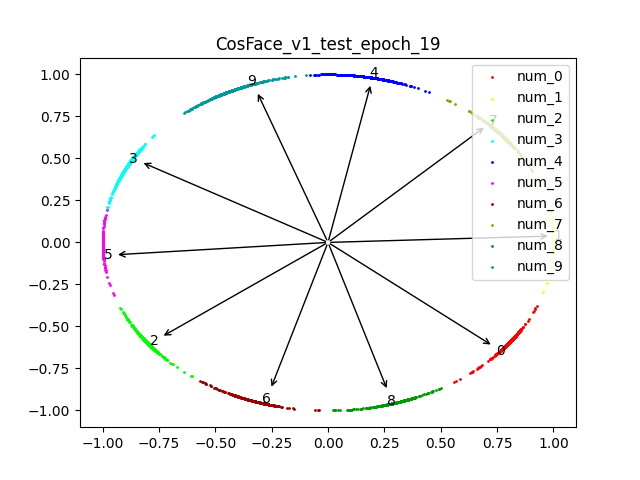
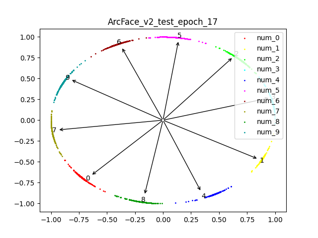

# Visualization of Face Loss

It contains softmax loss, norm softmax loss, L-softmax loss, A-softmax loss, CosFace loss, ArcFace loss.

## Model Architectures

### The Main Module

We use the LeNet++ architecture which is come from the paper CenterLoss published in ECCV 2016.

The CNNs Architectures is sample. Visit the paper CenterLoss Table 1 for more details.

I also complete a mini resnet18 model (used as default), see `model.py` for more details.

You can change the command line parameters to select different models.

### Angle Linear Module

We use the formula which can be found in the paper ArcFace publiceded in CVPR 2019. 

<!-- $$L=-\frac{1}{N} \sum_{i=1}^{N} \log \frac{e^{s\left(\cos \left(m_{1} \theta_{y}+m_{2}\right)-m_{3}\right)}}{e^{s\left(\cos \left(m_{1} \theta_{y_{i}}+m_{2}\right)-m_{3}\right)}+\sum_{j=1, j \neq y_{i}}^{n} e^{s \cos \theta_{j}}}$$ -->

To make it more universal, the module `AngleLinear` has some parameters to present different losses.

| loss name    | w_norm | x_norm | s | m1 | m2  | m3 |
| ---------    | ------ | ------ | - | -- | --  | -- |
| softmax      | False  | False  | 1 | 1  | 0   | 0  |
| norm-softmax | True   | True   | 1 | 1  | 0   | 0  |
| L-softmax_v1 | False  | False  | 1 | 2  | 0   | 0  |
| A-softmax_v1 | True   | False  | 1 | 2  | 0   | 0  |
| A-softmax_v2 | True   | False  | 1 | 3  | 0   | 0  |
| CosFace_v1   | True   | True   | 4 | 1  | 0   | 0.1|
| CosFace_v2   | True   | True   | 4 | 1  | 0   | 0.2|
| ArcFace_v1   | True   | True   | 4 | 1  | 0.1 | 0  |
| ArcFace_v2   | True   | True   | 4 | 1  | 0.2 | 0  |
| ArcFace_v3   | True   | True   | 4 | 1  | 0.3 | 0  |

## To Run

1. `python main.py --lossname ArcFace_v1`, or other loss in the table above
2. `python create_git.py --lossname ArcFace_v1`, or other loss in the table above
3. Read the config file `config.json` for more details

## Results

We use the SGD optimizer and train 20 epoches for each loss. The acc is below.

| loss name    | test acc |
| ---------    | ------ |
| softmax      | 92.95 |
| norm-softmax | 89.91 |
| L-softmax_v1 | 63.50 |
| A-softmax_v1 | 73.88 |
| CosFace_v1   | 98.69 |
| ArcFace_v1   | 98.50 |
| ArcFace_v2   | 98.45 |
| ArcFace_v3   | 76.60 |

> `Nan` means that I haven’t trained with similar results because the encode spatial dimension is too low.

## Visualization

| loss name | test for best epoch |
| - | - |
| softmax |  |
| norm-softmax |  |
| L-softmax_v1 |  |
| A-softmax_v1 |  |
| CosFace_v1   |  |
| ArcFace_v1   |  |
| ArcFace_v2   |  |
| ArcFace_v3   |  |
